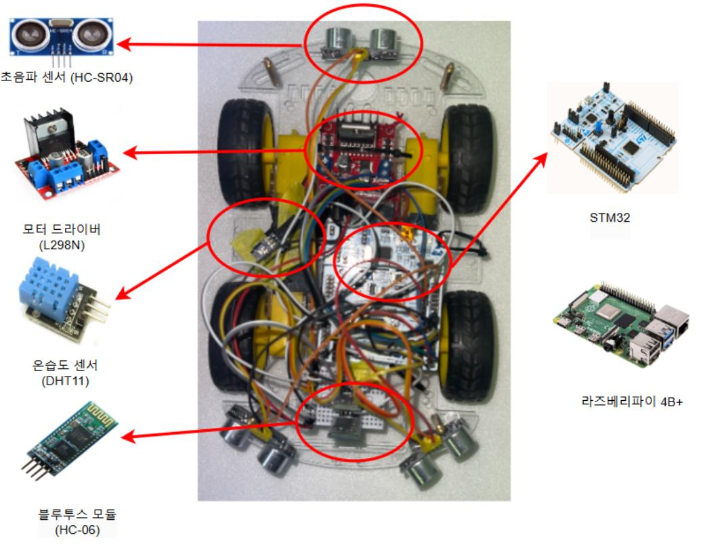

# SmartRover:stm32 활용 탐사로봇

한 줄 설명: STM32F4를 사용한 온습도측정 자율주행 RC카 제작 프로젝트 입니다.

---

## 📖 요약(Index)

### 1.개요

- 초음파 센서 기반 자율 주행을 통해 위험환경을 이동하고, 온습도 센서를 이용해 환경 데이터를 수집하고 분석하는 자율주행 자동차를 제작하는 프로젝트입니다.
- 자율주행 기술을 통해 장애물 회피 주행 구현
- `DHT11`를 이용한 실시간 환경 데이터 수집 및 `raspberry pi` 의 `mariaDB` 데이터 저장 수행
- 주행기능과 데이터 수집을 담당하는 `stm32`와  `raspberry pi`간 통신 연결 수행

### 2.개발배경

- 방사능 지대, 화재 현장 등 위험 환경에 대해 안전하게 탐사를 진행하도록 개발했습니다.
    - 효율성 증대 : 인력 투입에 필요한 안전 비용 및 인건비 절약을 통해 효율성 증대.
    - 안정성 확보 : 인력 투입을 최소화하여 추가 인명피해를 예방.
    - 데이터 수집 : 실시간 환경 데이터를 수집하여 분석에 활용.

### 3.일정

### 4.플로우 차트

---

## ⚙️사용 도구 및 개발환경(Skill)

### 1.개발 환경

### 2.사용 부품

---

## ⏰프로세스(Process)

### 1. 하드웨어 설계 및 시스템 설계

- **하드웨어 설계** :
    - STM32 마이크로컨트롤러(`STM32F4E`)와 관련 부품 연결
    - 데이터 수집을 위한 `STM32`와 `Rasberry pi`  통신 연결
- **시스템 설계** :
    - stm32 블루투스 모듈에 연동된 스마트폰 컨트롤을 통해 RC CAR조종
    - ON/OFF를 통해 전원 조작 → 자동 조작 / 수동 조작 선택
    - 자동 조작 →초음파를 이용한 이동
    - 수동 조작 → 버튼에 지정한 GPIO 핀을 제어하여 모터의 회전 방향 설정
- **온습도 데이터 관리 :**
    - 전원 on상태일 시 일정 간격으로 측정 된 온,습도 데이터를 라즈베리파이로 전송
    - MariaDB에 저장된 데이터를 확인 및 시각화를 통해 관리

### 2. 하드웨어 연결 및 테스트

- stm32 모듈 연결
    - RC CAR 이동에 필요한 모듈 연결:
        - 1.주행 부문:모터 드라이브(`L298N`), 초음파 센서(`HC-SR04`)
        - 2.통신 부문: 블루투스 모듈(`HC-06`)
    - 온습도 측정 및 데이터 관리에 필요한 모듈 연결:
        - 1.온습도 측정 부문: 온습도 센서(`DHT11`)
- 라즈베리파이 모듈 연결
    - 데이터 관리를 위한 통신 연결:
        1. 라즈베리파이 자체 내장 블루투스와 연동 부문: 블루투스 모듈(`HC-06`)

### 3. 소프트웨어 설계 및 구현

- **모터 드라이버 제어**: PWM을 이용하여 스탭 모터를 제어, 각 층에 도달하면 포토인터럽트로 이동을 멈추도록 구현
- **wifi 통신 제어**: 서보 모터를 사용하여 엘리베이터 문을 열고 닫을 수 있도록 제어
- **데이터 관리**: 엘리베이터의 상태와 층 정보를 LCD에 출력하여 사용자에게 실시간으로 알림

### 4. 테스트 및 디버깅

- **동작 테스트**: 각 층에 도달 시 모터가 멈추고, LCD에 정확한 정보를 표시하는지 확인
- **에러 처리**: 예상치 못한 오류나 동작을 방지하고, 시스템의 안정성 확보

### 5. 최종 구현 및 최적화

- **타이머 및 인터럽트 최적화**: 스탭 모터 및 서보 모터 제어의 효율성을 높이기 위해 타이머 및 인터럽트를 최적화
- **시스템 안정성**: 고장이나 오류 발생 시 시스템 안정성을 위한 에러 처리를 추가하여 실시간 모니터링

---

## 🙋‍♂️역할(Role)

- lcd display 코드 구현 및 한국어 기능 삽입
    - lcd 화면 출력 설계: 엘레베이터 층 정보와 이동 상태를 실시간으로 표시하는 LCD화면 설계
    - 한국어 출력 기능 구현: 한국어 텍스트  출력 기능 추가, 한국어로 정보 제공
- Tact 스위치 설치 및 보드 연결
    - Tact 스위치 설치: 각 층에 대한 이동을 선택할 수 있는 스위치 연결
    - 회로 연결 및 테스트: 보드에 tact 스위치를 연결하고, 버튼 동작 확인
    - 입력 처리 코드 구현:Tact 스위치에서 발생하는 입력을 STM32가 처리할 수 있도록 인터럽트 기반의 입력 처리 코드 작성.
- 인터럽트 설치
    - 인터럽트 설치:모터의 동작을 실시간으로 제어하기 위해 인터럽트를 설정하고, 안정적인 값 측정을 위해 층별 간 적절한 간격을 두어 인터럽트 설치.

---

## 🎯 결과 및 성장 (Result & development)

### **1. 하드웨어 제어 및 안전성 확보**

- stm32기반 하드웨어 제어 시스템을 개발하고, 각 센서 및 모터를 안정적으로 제어할 수 있는 방법을 학습했습니다.
- 스탭 모터와 서브모터의 제어를 통해 다양한 하드웨어와의 연동에 대한 이해도를 높였습니다.

### **2. 인터럽트 및 타이머 처리**

- 인터럽트를 사용하여 실시간으로 각 층에 도달했을 때 모터를 멈추고, 타이머를 통해  서보 모터의 움직임을 정밀하게 제어하는 방법을 익혔습니다.

### **3. 프로젝트 관리 및 구현**

- 프로젝트의 전반적인 계획, 하드웨어와 소프트웨어 설계, 구현, 테스트까지 관리하며 종합적인 시스템 설계 및 개발을 경험했습니다

---

## 👨‍💻Link

- Github

[https://github.com/jo5862/stm32_auto_move_car](https://github.com/jo5862/stm32_auto_move_car)

- Youtube

1.RC CAR 시연 영상

[https://drive.google.com/file/d/1YcvuKbiXJZZgSRuTLJkyAE1jlI6I5BtK/view?usp=drive_link](https://drive.google.com/file/d/1YcvuKbiXJZZgSRuTLJkyAE1jlI6I5BtK/view?usp=drive_link)

2.온습도 측정 시연 영상

[https://drive.google.com/file/d/1rL7i6DGcA2o-cCzPH_Nc02T1PCJb7rUx/view?usp=drive_link](https://drive.google.com/file/d/1rL7i6DGcA2o-cCzPH_Nc02T1PCJb7rUx/view?usp=drive_link)

---

## 🎙발표자료(**presentation file)**

---

[https://docs.google.com/presentation/d/1s-ZnuLnBE3vsjzT-X-5wKW5sccRC4pwI/edit?usp=sharing&ouid=116019234694698271598&rtpof=true&sd=true](https://docs.google.com/presentation/d/1s-ZnuLnBE3vsjzT-X-5wKW5sccRC4pwI/edit?usp=sharing&ouid=116019234694698271598&rtpof=true&sd=true)
